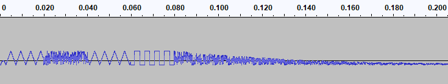

[Instruments](#instruments)

[Phrases](#phrases)

# Instruments #

Instruments are defined by making use of a microcode that executes intructions on a virtualised SID. These instructions allow to create intruments that are more complex than it would be possible by just defyning a waveform and an ADSR envelope. Microcoded instruments can evolve all the sound parameters over time, giving access to a more rich sound palette. We will refer to the Instrument MicroCode as IMC throughout this text and, where needed, in the source code.

## The virtualised SID Registers ##

IMC operates on a virtualised SID that exposes the SID 29 registers in just 16 registers: 7 voice registers and 8 global registers (there's an unused register between the two blocks to align things nicely). The 7 voice registers, as opposed to the 7 registers per voice of the SID, allow to write instruments in IMC that can be played on any voice. The global 8 registers are the voice independent registers as found in the SID. Below is the registers map as seen by IMC intructions.

| REG | Direction | Purpose |
|---|---|---|
| 0 | W | Voice Frequency Low |
| 1 | W | Voice Frequency Hi |
| 2 | W | Voice Pulse Width Low |
| 3 | W | Voice Pulse Width Hi |
| 4 | W | Voice Control Register |
| 5 | W | Voice Attack/Decay |
| 6 | W | Voice Sustain/Release |
| 7 | W | Not in use |
| 8 | W | Filter Cutoff Low |
| 9 | W | Filter Cutoff Hi |
| 10 | W | Filter Resonance and Voice Selectors |
| 11 | W | Mode and Volume |
| 12 | R | Potentiometer X |
| 13 | R | Potentiometer Y |
| 14 | R | Oscillator 3 Sample |
| 15 | R | Envelope 3 Sample |

## IMC Instructions ##

The following instructions are available in IMC. Most intructions, once executed, cause the execution of the following instruction to take place immediately, except for those intructions that return a status register with the Yield (Y) flags set. Instructions returning with the Y bit set will cause the player to give up execution for that voice until the next frame triggers a call to the routine.

Each instruction is encoded in the high nibble of the command value. The lower nibble of the same byte is the first, 4 bits, parameter of the instructions, this is referred as P0. Some commands require an other byte to encode an other parameter, this is referred to as P1.

```
0          8         16
| CMD Byte | Operator |
| CMD | P0 |    P1    |
```

### WIN - Wait Init ###

Initialises the wait counter to the desired amount of ticks a following wait instruction will have to wait. The amount of ticks to wait is encoded in P0 as the amount of ticks/2, this allows waits ranging from 33mS to to 528mS in steps of 33mS. Note that while MUWAIT is an 8 bit register, and can be set for a delay up to 256 ticks (roughly 4 seconds), the WIN instruction allows to set it only up to 32 because of the limited size of P0. This was considered enough for intra-instruction durations, longer durations can be set for the whole note in the track note length byte.

```
LENGTH:1        STATUS Y---
                       0---
AFFECTS:       
P0         => MUWAIT
INSTRP + 1 => INSTRP
```

### LWW - Loop While Waiting ###

Waits the amount of ticks in MUWAIT. This is not an idle wait, the command will set the Y flag so it will cause the virtualised SID to yield and the other voices will be executed as well. Additionally INSTRP will be decremented by P0 unless MUWAIT has reached zero in which case the command will let the flow progress to the next instruction.

```
LENGTH:1        STATUS Y---
                       1---
AFFECTS:       
MUWAIT - 1  => MUWAIT
INSTRP - P0 => INSTRP IF MUWAIT>0
INSTRP + 1  => INSTRP IF MUWAIT=0
```

### WRI - Write Register ###

Writes a value into the specified register. This command takes the virtualised SID register in P0 and the value to write in P1. See "Virtualised SID registers" section above for the actual registers map. 

```
LENGTH:2        STATUS Y---
                       0---
AFFECTS:       
P1         => REG[P0] 
INSTRP + 2 => INSTRP
```

### FLT - Setup filter ###

Sets the filter parameters and enables the filter for this instrument voice. P0 contains the filter type (HP=4, BP=2, LP=
1). P1 higer nibble contains the filter resonance while the lower two bits set the filter cutoff/center frequency as a product of the current voice frequency by a constant (1.5, 3, 6), this simplifies having the filter to track the current note being played.

```
LENGTH:2        STATUS Y---
                       0---
AFFECTS:       
P0             => SID[FILTER TYPE]
P1.7-4         => SID[FILTER RESONANCE]
K[P1.1-0]*FOSC => SID[FILTER CUTOFF]
INSTRP + 2     => INSTRP

K IS A FOSC MULTIPLIER SET ACCORDING TO THE FOLLOWING VALUES OF THE TWO LOWER BITS OF P1:

  | P1.1 | P1.0 |  K  |
  |   0  |   0  | 1.5 |
  |   0  |   1  |  3  |
  |   1  |   0  |  6  |
```

*NOTE* Since there is only one filter in the SID it's up to the composer to make use of only one instrument that requires a filter at a given time. Also, since moving the filter voice selector creates a click it's advisable to use instruments that require filtering on only one voice throughout the song. Anyhow the commands allow to freely choose which which are passed through the filter as, on occasions, it might be desirable to have more than one voice going through the same filter.

### YLD - Yield execution ###

Yields exection, other voices will be processed and this instruments next instruction will not be executed until the next tick.

```
LENGTH:1        STATUS Y---
                       1---
AFFECTS:       
INSTRP + 1 => INSTRP
```

### END - End sequence ###

Ends an instrument commands sequence and yield. No more code for this instrument will be executed until a new note on it is played.

```
LENGTH:1        STATUS Y---
                       0---
AFFECTS:       
---
```

## Examples ##

### Gunshot ### 

The gunshot effect is obtained by gating quickly on and off some noise with an envelope decaying slowly. This gives the initial bang followed by a tail of fading noise. We set the voice frequency to 622Hz, noise in the SID is colored, so setting a frequency actually has an effect.

```
        BYTE $25, $02   ; WRI 5, $02            ATTACK 0MS, DECAY 16MS
        BYTE $26, $A9   ; WRI 6, $A9            SUSTAIN 10, RELEASE 750MS
        BYTE $21, $28   ; WRI 1, $28            FREQUENCY HI
        BYTE $20, $C8   ; WRI 0, $C8            FREQUENCY LO (622HZ)
        BYTE $24, $81   ; WRI 4, %10000001      WF NOISE, GATE ON        
        BYTE $02        ; WIN 2                 INIT WAIT, 4 TICKS
        BYTE $10        ; LWW                   LOOP (HERE) WHILE WAITING THE 4 TICKS
        BYTE $24, $80   ; WRI 4, %10000000      NOISE, GATE OFF        
        BYTE $FF        ; END
```

### Drum ###

The drum is obtained with a slowly (D=240ms) fading sequence of triangle,noise,triangle and pulse. Noise is at around 700Hz while the other waveforms are all played at around 220Hz.



```
DRUM1   BYTE $40, $8F, $0E, $00, $08, $10, $00, $F7
                        ; VIN FREQ=220Hz, PW=50%,TRIANGLE, GATE OFF,
                        ; A=2mS D=6mS S=15  R=240ms            
        BYTE $24, $11   ; WRI 4, %00010001      TRIANGLE, GATE ON        
        BYTE $E0        ; YLD

        BYTE $21, $2E   ; WVR 1, $2E            FREQ=700Hz
        BYTE $24, $81   ; WRI 4, %10000001      NOISE, GATE ON        
        BYTE $E0        ; YLD

        BYTE $21, $0E   ; WVR 1, $0E            FREQ=220Hz
        BYTE $24, $11   ; WRI 4, %00010001      TRIANGLE, GATE ON        
        BYTE $E0        ; YLD

        BYTE $24, $41   ; WRI 4, %01000001      PULSE, GATE ON        
        BYTE $E0        ; YLD
        
        BYTE $21, $2E   ; WVR 1, $2E            FREQ=700Hz
        BYTE $24, $80   ; WRI 4, %10000000      NOISE, GATE OFF
        
        BYTE $FF        ; END
```


# Phrases #

A phrase is a sequence of notes played on a given instrument (or instruments) with specific intervals. Additionally phraes can contain special elements, referred to as Phrase Instructions that allow to control repetition of the phrase.

## Phrase Elements ##

Each phrase element is 32 bits long. The purpose of each bit is different whether the element is a note or an instruction. Notes have a value below 127 in the second byte while instructions are above that. 

```
0          8   9   11    16         24         31
| Tick     | 1 | I | P0  | P1       | P2        |
| Tick     | 0 | Note    | Instrum  | Duration  |
```

**Tick** At which tick this istruction/note is applicable. Tick is 8 bits long, this does not restrict the phrase length to 256 ticks though (roughly 4 seconds) but restricts the maximum period between two entries in the phrase, this is because the track is executed sequentially and not re-scan fom the beginning at each tick. Consider for instance the following sequence:

```
 $00 .......
 $50 .......
 $20 .......
 $F0 .......
```

The first element will be executed at the first tick, the second at tick $50, tick will progress and wrap around to $00, the phrase pointer though is pointing now at the 3rd entry, so it will wait until tick $20 to execute the second entry and so on, so a phrase is virtually unlimited in length, though it's clearly memory bound.

**I** Instruction. I is two bits long so there is space for up to four instactions. Each instruction can have up to three parameters, **P0** which is 5 bits and **P1** and **P2** which are 8 bits each. See paragraph below "Phrase Instructions" for more details.

**Note** is the MIDI note number. Only MIDI notes 21(A0) through 105(A7) are supported.

**Instrum** the instrument number to be played.

**Duration** the duration of the note in ticks. Note that if the duration+tick exceed the next element tick the next element will play and just override the previously running note. This might be desired in some cases but can also create unwanted audio artifacts as the voice gate will not have chance to be closed while the next instrument sets itself up.

## Phrase Instructions ##

### NOP - No Operation ###

This command does nothing, it's useful though if you need a pause longer than 256 ticks in your phrase as tick wraps around at 256.

```
AFFECTS:       
----
```

### REP - Loop ###

Repeats the phrase a given amount of times, then falls through to the next phrase.

```
AFFECTS:       
LOOP + 1 => LOOP IF LOOP < P0
       0 => LOOP IF LOOP < P0
       0 => TICK
P1.P2    => PHRASP IF LOOP < P0
PHRASP+1 => PHRASP IF LOOP = P0
```

## Examples ##

This is an example of a simple endless loop playing two different notes on the same instrument.

```
  PHRASE  BYTE 00, 40, 04, 10              ; AT TICK 0 PLAY NOTE 40 ON INSTRUMENT 4 FOR 10 TICKS.
          BYTE 15, 70, 04, 10              ; AT TICK 15 PLAY NOTE 70 ON INSTRUMENT 4 FOR 10 TICKS.
          BYTE 25, $A0, <PHRASE, >PHRASE   ; AT TICK 25 GO INFINITE TIMES ($A0) TO PHRASE.
```

This is an example of a pharse repeating a certain amount of times (eg an intro) and then falling through to the next phrase which, in this examples plays forever, but could be simply chained to others phrases.

```
  PHRASE  BYTE 00, 40, 04, 10              ; AT TICK 0 PLAY NOTE 40 ON INSTRUMENT 4 FOR 10 TICKS.
          BYTE 15, 70, 04, 10              ; AT TICK 15 PLAY NOTE 70 ON INSTRUMENT 4 FOR 10 TICKS.
          BYTE 25, $A5, <PHRASE, >PHRASE   ; AT TICK 25 GO 5 TIMES ($A0) BACK TO PHRASE.
  PHRASE2 BYTE 00, 40, 05, 10              ; AT TICK 0 PLAY NOTE 40 ON INSTRUMENT 5 FOR 10 TICKS.
          BYTE 15, 70, 04, 10              ; AT TICK 15 PLAY NOTE 70 ON INSTRUMENT 4 FOR 10 TICKS.
          BYTE 25, $A0, <PHRASE2, >PHRASE2 ; AT TICK 25 GO INFINITE TIMES ($A0) TO PHRASE2.         
```


# Internals #

We will present here internal details of the player routine which are not needed in order to write music but could prove useful to better understand the overall architecture and allow someone to contribute new features.

## VTable ##

The VTable, short for Voice Table, is a 32 bytes table allocated in page zero. It contains 4 sets of 8 registers each. Of these sets 3 are associated with one voice each while the 4th is a copy of the set of registers for the currently playing voice. 


| OFF | Sym | Description |
|---|---|---|
| 0 |  PHRASPL | Phrase pointer LSB |
| 1 |  PHRASPH | Phrase pointer MSB |
| 2 |  INSTRPL | Instrument pointer LSB |
| 3 |  INSTRPH | Instrument pointer MSB |
| 4 |  MUWAIT | Ticks left to wait for a WAI |
| 5 |  TICK | Current tick |


