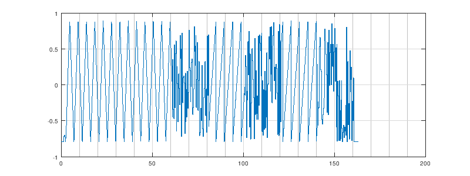
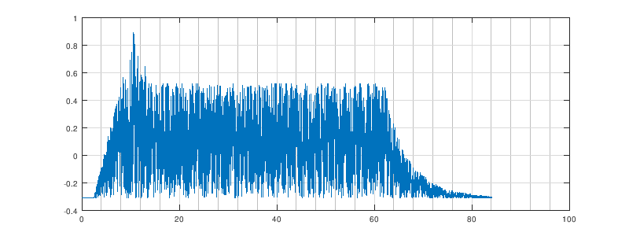

# Method #

In order to verify the code works as expected a series the tests defined in `test.asm` can be run. These are not fully automated tests. The general method is to define a test instrument, with certain characteristics that exercise a particular feature of the player and use that instrument, in isolation, on a voice. The sound output needs then to be sampled and visually analyzed, for instance in Octave,  to match the expected signal.

## TEST 1 ##

````ASM
        ; INSTRUMENT:   TEST1
        ; TESTS:        IMC WIN/LWW
        ; EXPECTED:     TRIANGLE    3 TICKS
        ;               NOISE       1 TICK
        ;               SAWTOOTH    1 TICK
        ;               NOISE       1 TICK
        ;               SAWTOOTH    1 TICK
        ;               NOISE       1 TICK      
        ;               END

TEST1   BYTE $41, $80, $0E, $00, $00, $10, $00, $F7
                        ; VIN                   FREQ=220Hz, 
                        ;                       TRIANGLE, GATE ON 
                        ;                       A=2mS D=6mS S=15  R=240ms 
                   
        BYTE $02        ; WIN 2                 INIT WAIT, 2 LOOPS                        
        BYTE $10        ; LWW 0                 LOOP WHILE WAITING OFFSET 0
        
        BYTE $24, $81   ; WRI 4, %10000001      NOISE, GATE ON        
        BYTE $E0        ; YLD

        BYTE $02        ; WIN 2                 INIT WAIT, 2 LOOPS                        
        BYTE $24, $21   ; WRI 4, %00100001      SAWTOOTH, GATE ON        
        BYTE $E0        ; YLD
        BYTE $24, $81   ; WRI 4, %10000001      NOISE, GATE ON        
        BYTE $15        ; LWW 5                 LOOP WHILE WAITING OFFSET -5

        BYTE $24, $00   ; WRI 4, %00010001      NO WAVEFORM, GATE OFF
        BYTE $FF        ; END
````        
Expected waveform:




## TEST 2 ##

```ASM
        ; INSTRUMENT:   TEST2
        ; TESTS:        IMC WRI/VIN
        ; EXPECTED:     NOISE RAISING 2mS
        ;               NOISE FALLING TO 75% IN FEW mS *1) 
        ;               NOISE SUSTAINED AT 75% FOR 2 TICKS
        ;               NOISE FALLING TO 0% IN 24mS
        ;               END
        ;
        ; *1) THE ADSR IS SET FOR 24mS DECAY, THIS IS THE TIME TO REACH
        ;     ZERO THOUGH, SINCE SUSTAIN IS AT 10 THE DROP WILL BE MUCH SHORTER.

TEST2   BYTE $41, $8F, $FE, $00, $00, $80, $11, $A1
                        ; VIN                   FREQ=3700Hz, 
                        ;                       NOISE, GATE ON,
                        ;                       A=2mS D=24mS S=10  R=24ms
                   
        BYTE $02        ; WIN 2                 INIT WAIT, 2 LOOPS                        
        BYTE $10        ; LWW 0                 LOOP WHILE WAITING OFFSET 0
                
        BYTE $24, $80   ; WRI 4, %10000000      NOISE, GATE OFF
        BYTE $FF        ; END
```

Expected waveform:


