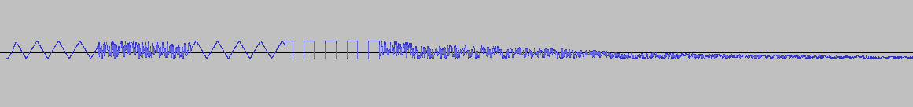

# Method #

In order to verify that the code works as expected a series of tests have been run. The general method is to define a test intrument, with certain characteristics that exercise a particular feature of the player and use that instrument, in isolation, on a voice. The sound output has then been sampled and visually analyzed in Audacity to match the expected signal.

## TEST 1 ##

````ASM
TEST1   BYTE $40, $8F, $0E, $00, $08, $11, $00, $F7
                        ; VIN FREQ=220Hz, PW=50%,TRIANGLE, GATE ON,
                        ; A=2mS D=6mS S=15  R=240ms        
                        
        BYTE $21, $2E   ; WVR 1, $2E            FREQ=700Hz
        BYTE $24, $81   ; WRI 4, %10000001      NOISE, GATE ON        
        BYTE $E0        ; YLD

        BYTE $21, $0E   ; WVR 1, $0E            FREQ=220Hz
        BYTE $24, $11   ; WRI 4, %00010001      TRIANGLE, GATE ON        
        BYTE $E0        ; YLD

        BYTE $24, $41   ; WRI 4, %01000001      PULSE, GATE ON        
        BYTE $E0        ; YLD
        
        BYTE $21, $2E   ; WVR 1, $2E            FREQ=700Hz
        BYTE $24, $80   ; WRI 4, %10000001      NOISE, GATE OFF
                
        BYTE $FF        ; END

        BYTE $24, $41   ; WRI 4, %01000001      PULSE, THIS SHOULD NEVER GET EXECUTED
        BYTE $E0        ; YLD
````        

### VIN Test ###

Verify that the VIN command correctly initialises a voice. The triangle wave is expected to have a frequency of 220Hz in the first part of the sequence, ie 4 periods in the 20mS duration.

### VWR Test ###

Verify that the VWR command correctly writes to the desired voice registester. The waveform is expected to change through the sequence triangle/noise/triangle/pulse.

### YLD Test ###

Verify that the the YLD command yields for 1 tick. Each step of the triangle/noise/triangle/pulse sequence is expected to last 20mS (one tick).

### END Test ###

Verify that the END command correctly terminates the execution of the IMC sequence. The change from noise to pulse at the end should not happen.

Sampled output:



## TEST 2 ##

The following instrument is applied to all voices.

```ASM
TEST1   BYTE $40, $8F, $0E, $00, $08, $11, $00, $F7
        BYTE $FF
```

### VWR Test ###

The VWR command works as expected on all voices.  A monitor is used to inspect the SID registers, all 3 voices are expected to be setup with the values as in the dump below.

```
>M D400 D41F
C:d400  8f 0e 00 08  11 00 f7 8f  0e 00 08 11  00 f7 8f 0e  00 08 11 00  f7 00 00 00  0f 00 00 00  00 00 00 00
```
